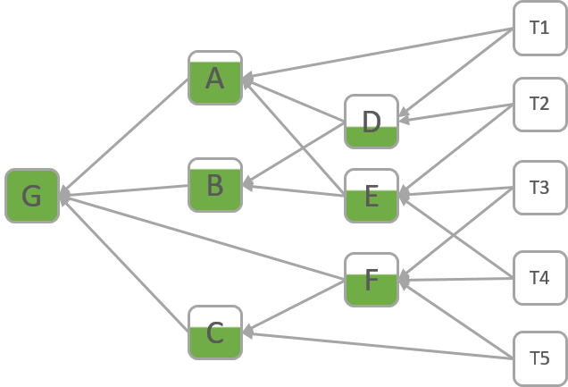
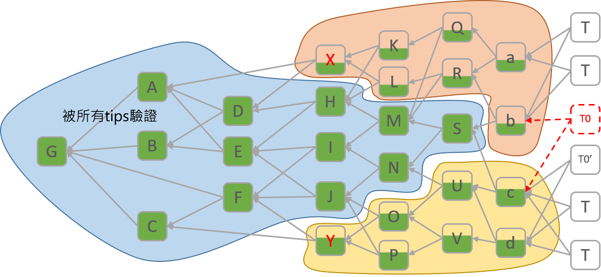
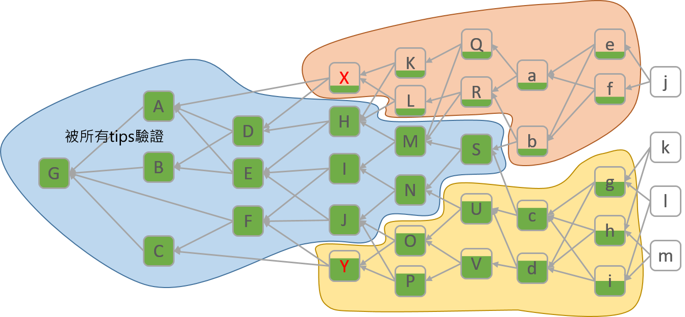
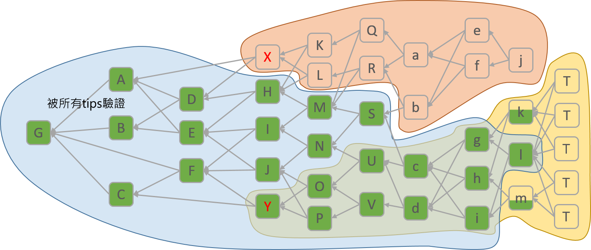

# 在沒有 Coordinator 的狀況下，Tangle 如何抵擋雙重支付攻擊(Double-Spend)？

在每項分散式帳本技術(DLT)中，每筆交易會有一定機率驗證有效。在比特幣中，一筆交易是否有效決定於寫入最長的鏈，所以交易無效的機率取決於有更長串的區塊鏈出現而該交易不存在該鏈中。

在區塊鏈技術中，兩筆互斥的交易無法存在於最長的區塊鏈中。

在 Tangle 中則基本上非常不同，兩筆互斥交易可以存在於 Tangle 中，這不會造成問題因為最終只有一項會被判定為有效的。

每筆交易被驗證為有效的機率等同於tips驗證直接或間接該交易的比例。
以下圖示來解釋雙重支付如何被判定的，我們先從一條沒有衝突的 Tangle 開始。假設此 Tangle 有 5 個 tips（而且沒有 Coordinator 存在），G 是創始交易、A 到 F 是每筆交易、T1 到 T5 是 tips（還沒受到確認的交易），綠色代表的是「交易確認的比例」，也就是該交易被驗證的層級：

| 交易 | 同意的 Tip | 確認比例 | 驗證百分比
| :---: | :---: | :---: | :---: |
| G | 所有 Tips | 5/5 Tips 確認 | 100% 驗證 |
| A | T1,T2,T3,T4 | 4/5 Tips 確認 | 80% 驗證 |
| B | T1,T2,T3,T4 | 4/5 Tips 確認 | 80% 驗證 |
| C | T3,T4,T5 | 3/5 Tips 確認 | 60% 驗證 |
| D | T1,T2 | 2/5 Tips 確認 | 40% 驗證 |
| E | T2,T3,T4 | 3/5 Tips 確認 | 60% 驗證 |
| F | T3,T4,T5 | 3/5 Tips 確認 | 60% 驗證 |

現在假設 X 和 Y 是兩筆互斥的交易（也就是所謂的雙重支付），接著又有 6 個新的 tips 加入，X 和 Y 會分別被兩個 tips 同意，也就是有 33% 驗證比例。

當我們加入更多筆交易，衝突便會被偵測到。現在加入新的交易 Q, R, S, U, V, a, b, c, d，然後我們將驗證 X 的交易標為橘色，驗證 Y 的交易為黃色。假設 T0 想附加到 b 和 c，但這樣一來就偵測到衝突了，因此新的 tip 會為 T0 重新選擇，最後附加到 c 和 d。

再加入 4 個新 tips 然後隨機選擇，到這時有 3 個 tips 連接黃色，只有兩個在橘色，所以數據上來說，選擇黃色的交易會比較多。

再加入五筆交易，現在只剩一個 tip 在橘色，而且與其他 tip 驗證的話都會產生衝突，所以不可能再被選到。橘色部分最終會被孤立，區塊裡的 tip 會被視為「old tip」不再被任何誠實節點接納，這樣一來就解決了分歧的問題。

在此例中，tangle選擇了Y為有效交易，基本上這項選擇是隨機的，但是一旦決定之後它便不可能再回朔。
至於偵測的時間，你可以依據以下因素判定：
- 新交易的數量
- tangle的平均「寬度」
