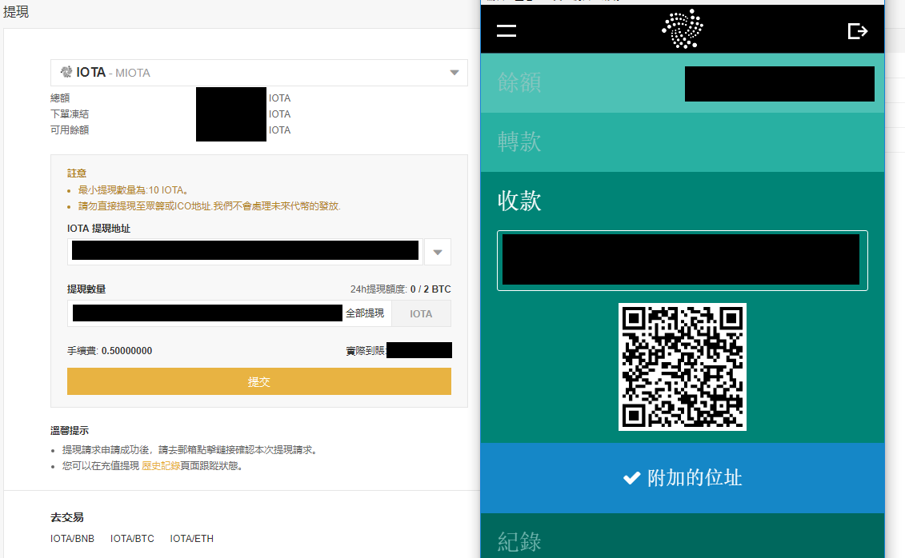

# 從交易所將 Miota 轉帳到自己的錢包
當你把錢轉到自己的錢包後就代表不再是由交易所保管，而是你自己要負責確認自己錢包的安全，這篇僅列出如何轉帳到自己錢包的步驟，關於錢包的使用希望大家之後能自己學習知道如何操作。

## 產生自己的錢包種子
以下提供安全產生種子的方式，**注意種子就代表你錢包的一切與安全，請千萬不要輕易透露你的種子，並妥善保管好你自己的種子**
* [使用作業系統終端機安全產生種子的方法](https://hackmd.io/s/BkS2NOSBz)
* [使用 Web App 安全產生種子的方法](https://hackmd.io/s/HyhLH6EHG)
* [使用 KeePass 產用種子並安全保存的方法](https://hackmd.io/s/BJu5FZVBf)
## 安裝 IOTA 官方錢包
* 下載 IOTA 官方錢包（寫此文章時為 v2.5.7）：https://github.com/iotaledger/wallet/releases
* 輕錢包會需要手動連線到完整節點，官方錢包預設的完整節點通常都是處於壅擠的狀態，常常會連不上或是嚴重延遲，以下提供一些健康的完整節點列表：
　1. https://iotanode.host
　2. http://iota.dance/nodes
　3. https://iotasalad.org/nodes
　4. http://iotatoken.nl
　5. http://www.tangleno.de
* 開啟錢包後先別輸入種子登入，到「工具」>「編輯節點配置」然後輸入你選擇的節點，其他設定可以參考以下圖片。

* 如果發現連不上或是出現錯誤的話，就重開錢包、更換節點 IP 或是將 Curl Implementation 的選項改為「CCurl」。總之輕錢包要能夠正常運作和連上的節點有很大的關係，**請花多一點時間確定你有連上健康的完整節點**。
* 假如有連上後，想確定節點有無同步（也就是健不健康）可以檢查錢包左下角的數字與官方 [Discord](https://discord.gg/rx5uu8z) #botbox 頻道中最新的 milestone 有無一致。正常來說錢包顯示的兩個數值是要一模一樣而且和 #botbox 的 milestone 是一致的。

* 確定連上後就可以輸入種子登入，在輸入種子後可以檢查後面末 3 碼的 checksum 有沒有顯示出來，記下 checksum 以後能夠確認你有沒有輸入正確的種子。

## 交易所轉帳
* 這邊將使用幣安做為示範，而且假設你已經知道如何提現其他貨幣如 BTC、ETH
* 在提現頁面選擇 IOTA，其他交易所都應該大同小異。
* 在 IOTA 的收款欄中按下「附加到 Tangle」，**注意地址使用一次就換其他的地址**，一個錢包可以產生非常多不同的地址。
* 將地址複製到提現頁面然後輸入要轉帳的金額
* 提交後會需要做 2FA 和電子郵件確認等驗證

* 你可以到 [IOTAsear.ch](https://iotasear.ch/) 輸入地址或 bundle hash 查詢交易狀況。
* 從交易所轉到錢包的交易速度得看該交易所所選節點送出交易的狀況，不幸的話有時候會被卡好幾個小時，如果你知道錢包如何操作的話可以自己使用錢包的 Reattach 和 Promote 功能。不然也可以使用像是 [reattach.online](http://reattach.online) 幫你自動 reattach/promote。
