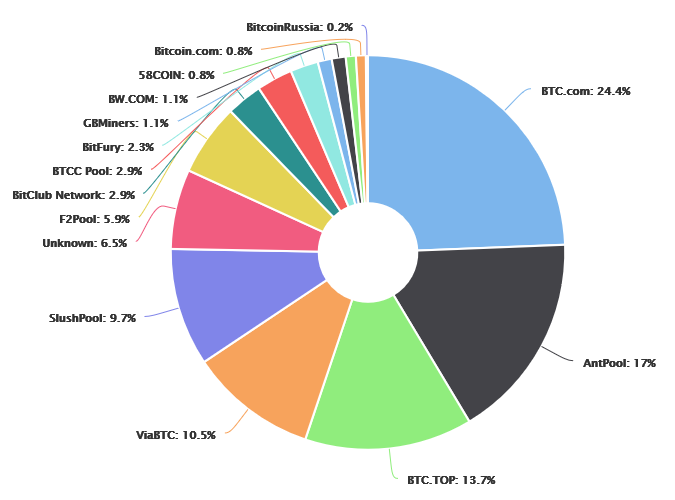
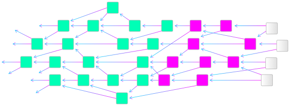
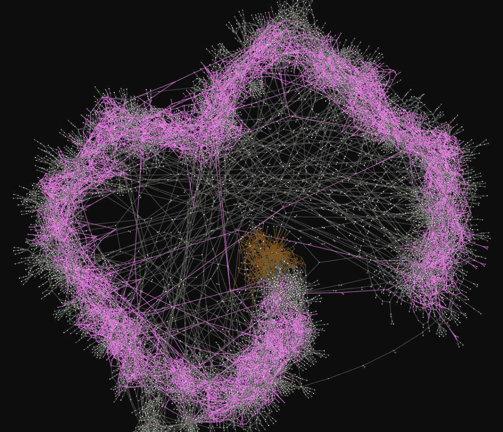
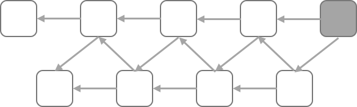
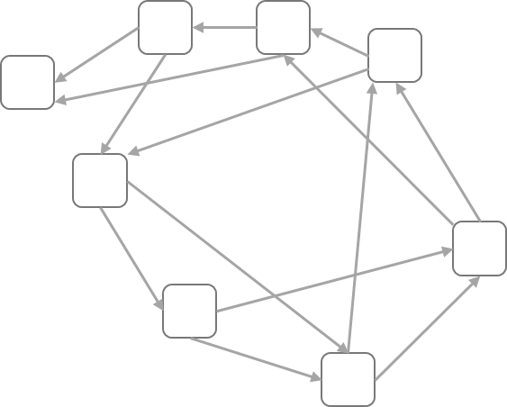
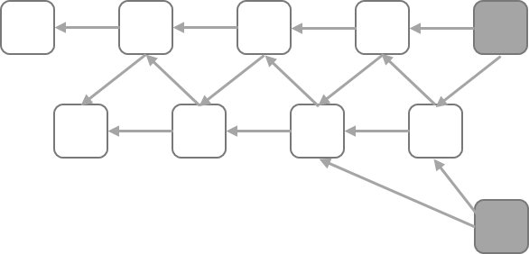
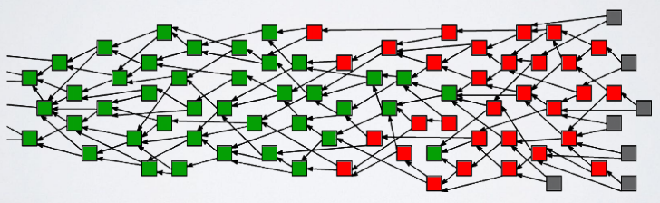
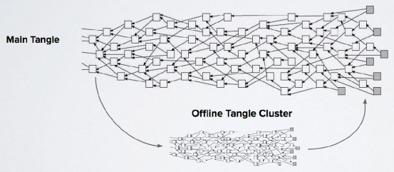

# 什麼是 IOTA？

甚麼是 IOTA 以及術語解說
[簡報版本](https://hackmd.io/p/SJEgLpRBf#/)

## IOTA 簡介
* IOTA 並不是物聯網（IOT）的縮寫，而是運用分散式帳本技術（DLT）的一種技術應用。
* David Sønstebø、Sergey Ivancheglo、Dominik Schiener 與 Serguei Popov 於 2015 年建立 IOTA。
* 在 2015 年末，IOTA 舉行首次貨幣募集（ICO）。在 2015 年 12 月 22 日總計籌得 1337 BTC（約為 50 萬美金）來作為專案開發之用。
* 所有的代幣（token）均售出給 ICO 投資者。
* IOTA 團隊在德國柏林註冊並建立了 IOTA 基金會，專注於開發及標準化全新的分散式帳本技術。
* IOTA 主要專注於物聯網與 M2M 經濟，不過此科技亦適用於 P2P 支付等應用。
* Mainnet 於 2016 年 7 月 11 日上線。
* [IOTA White Paper](https://iota.org/IOTA_Whitepaper.pdf)
* [中文版 IOTA 白皮書](https://hackmd.io/c/rkpoORY4W/https%3A%2F%2Fhackmd.io%2Fs%2FryriSgvAW)

## 貨幣總量
* 所有的 IOTA 貨幣均在一開始 ICO 時就已經全數發出，此技術沒有任何挖礦行為的參與。IOTA 總量為 ($3^{33}$-1) / 2 = 2,779,530,283,277,761 IOTAs = ~2.8 Peta IOTAs。
* 相比之下，到了 2140 年 10 月 8 日比特幣的最大總量會是 20,999,999.9769 個比特幣（約 2 千 1 百萬 BTC）挖出。在 2017 年 11 月 11 日已經挖了 16,675,488 個比特幣，這大概是全部的 79 %。
* 比特幣最大總量換算成其最小單位的話是 2,099,999,997,690,000 Satoshis = ~2.1 Peta Satoshis.
* 也就是說到了 2140 年 IOTA 的總供給量仍然會相較於比特幣多約 32 %。

## IOTA 特點
* 擴展性（Scalability）
* 去中心化（Decentralisation）
* 無交易手續費（No transaction fees）
* 抵抗量子計算（Quantum computing protection）

### 擴展性
* 網路會隨著交易數量的增加而越來越強健。
* 2017 年 4 月實驗過一次壓力測試，測試結果顯示 250 個節點所建構的網路能夠達成 112 ctps（每秒確認交易數量）。
* IOTA 能夠達成極高的交易流量，如果有越多的交易建立，交易確認的速率也會越來越快。

### 去中心化
* IOTA 並沒有礦工的設計，每個建立交易的人同時也是驗證交易的人，這代表每個人在建立共識的機制中均扮演相同的角色地位。
* 相較於比特幣網路中，算力中心化地被集中在少數的礦池中：https://blockchain.info/pools

### 無交易手續費
* 因為 IOTA 沒有交易手續費，所以非常適合微交易（micropayment）用途。
* 你可以發送 1 iota 的交易也不會花費任何手續費。
* 1 iota 是 IOTA 最小的金額單位，相當於比特幣的 1 Satoshi 和以太幣的 1 Wei。
* 像比特幣網路中往往須收取高額的手續費則不適合用於微交易方面，尤其是手續費高於交易價值的狀況。

### 抵抗量子計算
* 量子計算尚在非常前期的開發階段，但目前預估此科技將會在 2030 或 2050 年發展成熟。
* 量子電腦將能夠以極快的速度破解現今大多數的資訊加密手段。
* IOTA 使用的是 Winternitz One-Time Signature Scheme 屬於能夠抵擋量子計算的演算法，詳細請參考：https://eprint.iacr.org/2011/191.pdf

## 區塊鏈 vs 纏結（Tangle）
* 在區塊鏈的網路中（以比特幣為例），多筆交易會存在區塊中，然後區塊會連接在一起。

* IOTA 是第三代公開無權限（permissionless）分散式帳本，其網路所使用的為有向無環圖（Directed Acyclic Graph），IOTA 稱呼此 DAG 為纏結（Tangle）。
* 纏結的本身的架構**不是**區塊鏈。

## 纏結（Tangle）
* 纏結是一個基於有向無環圖的資料結構，每個方塊代表一筆交易，**每筆交易** 永遠會驗證之前兩個尚未驗證完的交易。

* http://iota.dance/live/

## 有向無環圖
* 有向代表的是圖只會指向單一方向。

* 無環代表的是圖不會形成迴圈，也就是以下情形不會發生。

## TIPS
* Tips 指的是在纏結中尚未確認的交易，它們是尚未開始接受驗證不過已經驗證之前兩筆交易的交易。

## 高度（Height）
* 高度定義為自創世交易 (genesis) 至當前這個交易的所有路徑中最長的長度。
* 舉例來說 G 的高度為 1 ，D 的高度為 3。

## 深度（Depth）
* 深度定義為自這個交易到某個 tip 的最長路徑。
* 舉例來說 G 對於 Tip A 的深度為 4，路徑為 F、D、B 與 A。

## 交易如何產生
* 產生交易需要三個步驟：
  1. 簽署（Signing）：節點產生交易並用你的私鑰進行簽章。
  2. Tip 選擇：節點使用隨機漫步蒙地卡羅演算法（Random Walk Monte Carlo）選擇兩個尚未確認的交易（tips）。
  3. 工作證明（Proof of Work）：節點檢查兩筆交易是否有衝突，算出加密謎題（hashcash）來進行工作證明（PoW）。Hashcash 反覆 hash 相同資料直到 hash 找到前面有幾個 0 的特定數值，此步驟主要是為了防範女巫攻擊（Sybil Attack）。女巫攻擊是假定有半數的算力來自於惡意節點。

## 隨機漫步蒙地卡羅演算法（RWMC）
* 隨機漫步蒙地卡羅演算法的目標為在困難的分布狀況下能產生公平的樣本數據。
* RWMC　在此有兩個用途：
  1. 產生交易時選出兩筆尚未確認的交易（tips）
  2. 判斷交易是否確認完成

## 交易確認
* 綠色：經由共識建立已經確認的交易
紅色：尚未被完全確認的交易
灰色：仍未開始接受確認的交易（tips）

* 所有交易的目標就是變成綠色
每筆交易希望從灰色變為紅色，最後變為綠色
* 綠色的交易均間接地被**所有**灰色交易驗證
每筆確認的交易絕對存在一條路徑連接到任一 tip。
* 欲判斷交易受到確認的等級，我們需要從深度著手。所以我們用 RWMC 跑了 N 次，交易受到確認的機率就會是 M 分之 N。M 代表的是你的交易存在一條路徑連接到不同 tip 的次數。
* 假設我們執行 RWMC 100 次，而總計有 60 個 tips 存在與你的交易連接的路徑，我們就說此筆交易為 60% 確認。此比例交由賣家自行決定交易是否已確認並出貨。同樣地，比特幣也是建議高額的交易最少等待 6 個區塊確認。深度越深的交易會花越久的時間去驗證。

## IOTA GITHUB
* IOTA Reference Implementation（IRI）、錢包與 libraries 的參考連結為：https://github.com/iotaledger
* IOTA Reference Implementation 是用 Java 編寫
* 目前 IRI 並不算是完成品。
* IOTA libraries 有不同的程式語言支援，像是 JavaScript、Python 以及 Go。

## 完整節點（FULL NODE）
* 欲架設完整節點你必須透過交換 IP 與鄰居建立聯繫。
* IP 位址建議只分享給你的鄰居以防安全。
* Peer discovery 目前有 CarrIOTA 團隊在開發。

## IOTA 地址使用注意事項
* 當你用一個地址發送出交易後，你就**不要**再使用此地址來發送。每次你發送一筆交易，該地址的私鑰將會透露一部份出來，IOTA 使用的是 Winternitz one-time signature，要是重複使用地址的話私鑰被取得的機率會上升。
* 你還是能夠用同一個地址無限制地接收交易，但如果該地址已經有發送過交易的話，就不要再拿來**發送或接受**交易。
* 種子不會因此被破解，達成上述條件的地址內所擁有的資金會有危險，而不是整個種子的錢包。

## 離線交易
* 一個纏結是可以暫時與網路分離的，我們稱此為分割（partitioning）。舉例來說，在一艘貨船中貨櫃的感應器因為遠洋運輸與主要纏結失去了連線，感應器是可以建立離線的纏結叢集。

## 協調器（Coordinator）
* 協調器（Coo）是由 IOTA 基金會建立數個完整節點分布在網路中。它產生 0 元交易作為 milestones 提供完整節點驗證參考。
* 它的主要目的為暫時保護尚處於嬰兒期階段的網路，以防由 GPUs 產生的大範圍攻擊方式。協調器指引纏結大致上成長的方向並設立些所謂的檢察點。
* 目前網路仍可以算是去中心化的，因為節點與協調器這樣的防衛機制並沒有違反共識的規則。
* 當 IOTA 網路流量夠多且夠穩定的話，協調器將會永遠被撤離。

## SNAPSHOT
* Snapshot 是讓帳本資料庫保持一定大小的方式。
* Snapshot 會組合數筆地指交易至一筆紀錄，儲存非零元的餘額並移除其他交易紀錄。
* 地址中的餘額將會扮演像是創世交易的角色，但不會有之前的歷史紀錄和資料附加於其中。
* 目前 Snapshot 為手動進行，不過未來將會設計為自動完成。
* 永久節點（Permanode）將會儲存 tangle 全部的歷史紀錄和資料。

## KECCAK-384 / KERL
* IOTA 基於 SHA-3/Keccak 建立自己的 hash function 為 Curl-P。
* 2017 年 7 月 14 日 [DCI 團隊聲稱](https://github.com/mit-dci/tangled-curl/blob/master/vuln-iota.md)此為加密函式且有碰撞漏洞安全危機
* [IOTA 團隊聲明](https://blog.iota.org/official-iota-foundation-response-to-the-digital-currency-initiative-at-the-mit-media-lab-part-1-72434583a2)此並非加密手段而是防抄機制（Copy Protection）
* 由於防抄機制發現之後，也就沒有存在的必要，2017 年 8 月 7 日 IOTA 團隊改用 Keccak-384 簡稱做 [Kerl](https://github.com/iotaledger/iri/commit/539e413352a77b1db2042f46887e41d558f575e5) 來產生地址與簽章交易
* Curl-P 仍有用在其他用途：https://github.com/iotaledger/kerl
