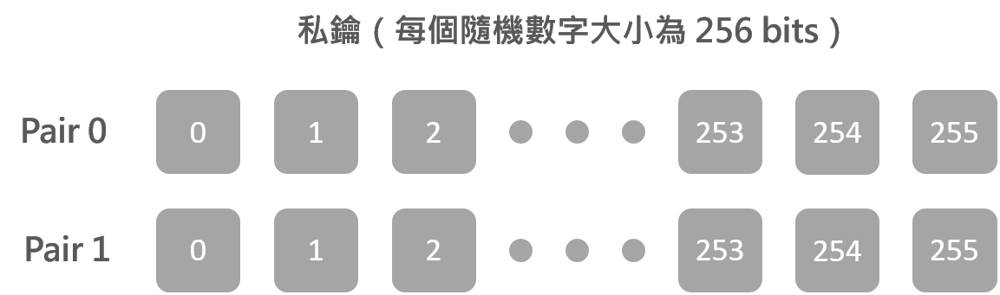
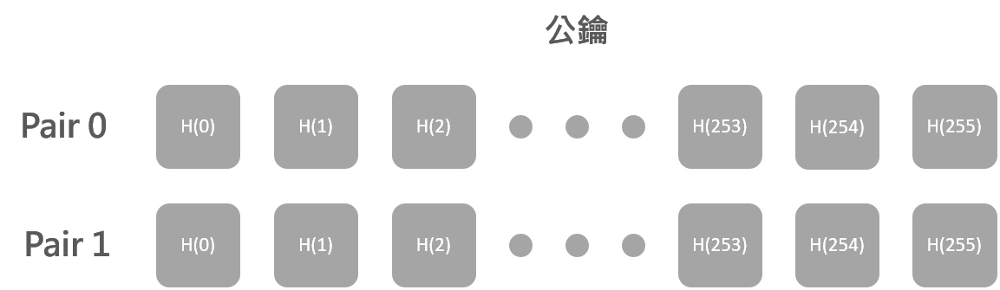
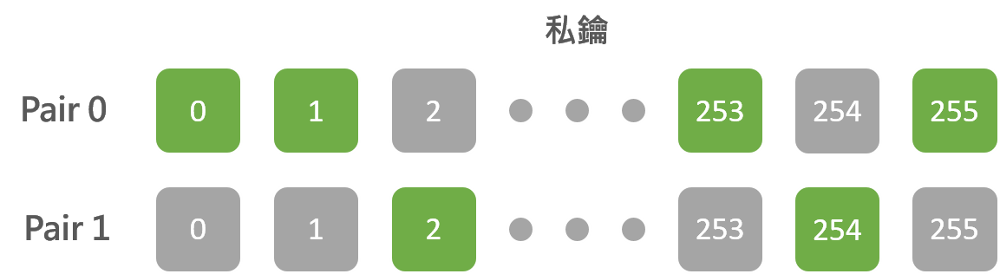
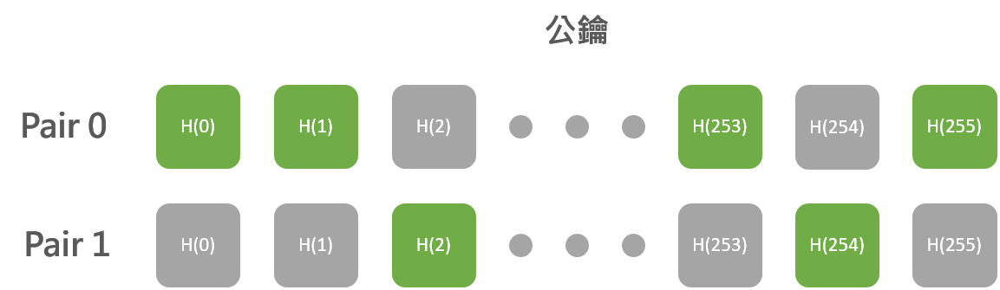
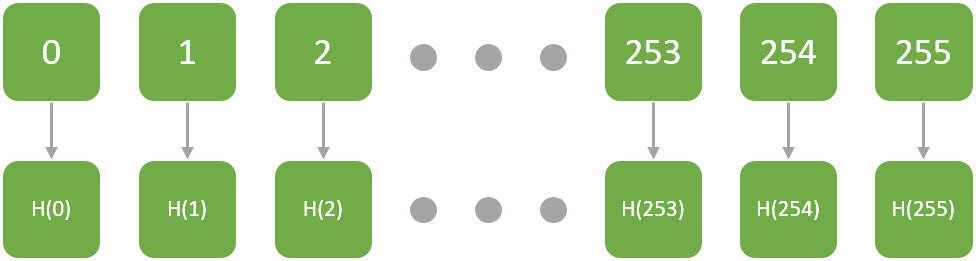

# 一次性簽章

## 數位簽章
* 數位簽章的應用有身分認證、完整性檢查以及不可否認性等用途
* 量子電腦的發展威脅到了目前大多數的數位簽章演算法，像是 Rivest–Shamir–Adleman (RSA) 和橢圓曲線數位簽章演算法(ECDSA)
* 密碼學家發展了許多不同的解決辦法來抵擋量子運算，其中以 hash-based signatures 最受期許
* 一次性簽章（OTS）屬於 hash-based signatures，其指的就是公鑰/私鑰 pair 只能使用一次，不然攻擊者將能夠取得更多部分的私鑰來破解簽章。

## Lamport one-time signature scheme
* 在 1979 年 Leslie Lamport 創立了只用具密碼學安全性的單向雜湊函數建構數位簽章。
* 此方法稱作 Lamport signature 或是 Lamport One Time Signature (OTS)scheme
* 其他不同的一次性簽章還有 Merkle OTS 和 Winternitz OTS
* 有鑑於 Lamport One Time Signature scheme 較容易了解，而且 Winternitz OTS 算是其變化類型，以下將用 Lamport signature 解釋為何重複使用 IOTA 地址發送交易會帶來安全風險

## 簽章舉例
* 今天假設 Alice 用隨機數字產生器產生了一對 256 個隨機數字，也就是總共 512 個隨機數字。每個隨機數字大小為 256 bits，這些隨機數字產生出私鑰：

* 將 512 個隨機數字用像是 SHA-256 進行 hash，這些 hash 過的隨機數字組成公鑰：

* 現在 Alice 有個文件或交易數據經過 SHA-256 hash 後為 256 bits：0101...1101
* Alice 想為他的文件產生數位簽章，所以她進行了以下步驟：
　1.檢查 hash 文件的每個 bit，也就是從 bit 0 到 bit 255
　2.如果 bit 為 0，發布 pair 0 的第 n 個數字
　3.如果 bit 為 1，發布 pair 1 的第 n 個數字
　4.掃過所有 bit 後，移除所有沒用到的數字

* 如此一來就產生了 256 個隨機數字做為數位簽章

* 可以發現數位簽章中僅包含一半的私鑰，另外 256 個數字並沒有人能知道，所以無法產生出相同的簽章出來
* Alice 傳送她的文件給 Bob，同時附上數位簽章與公鑰
* Bob 想要進行驗證的話，可以將文件用 SHA-256 hash 過後，和 Alice 產生簽章相同的方式來選擇公鑰的數字

* Bob 以此從公鑰中選出 256 個數字後，再將數位簽章進行 hash 與這些數字比對，如果一模一樣即表示簽章是正確的

* Lamport signature 產生的數位簽章會揭露部分的私鑰
* 此例中私鑰有 512 個數字，簽章揭漏了 256 個數字
* 再次使用此私鑰的話就會再增加一半的風險
* 攻擊者暴力破解的機率會從 $1/2^{256}$ 上升到 $1/2^{128}$
* 同樣的私鑰在使用第三次的話就會是 $1/2^{64}$，第四次會是 $1/2^{32}$
* 再次聲明 IOTA 的簽章是用 Winternitz One Time Signature(WOTS)，和此例的 Lamport signature 是不一樣的，這邊的舉例是為了方便理解重複使用地址所帶來的風險，之後會再詳細分析 WOTS 實際在 IOTA 中的簽章過程。
