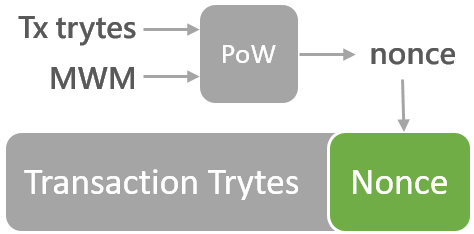

# 工作證明

## 產生交易
欲發起交易基本上會進行三個步驟
1. 組成 Bundle 然後用地址的私鑰進行簽章：
- IOTA 用 bundle 將數筆交易組織起來，包含輸出到接收地址的交易(output)和從發送地址輸入的金額(input)，關於 bundle 的詳細內容會在日後作介紹
- 在 IOTA 中可以簡單將交易分為兩種類型。一種就是有金額的交易，你必須為輸入進行簽章；而另一種可以直接用地址傳送 0 元的交易，像是傳送訊息。Bundle 會顯示出傳送的金額價值。
- 這邊所說的交易是一個包含一個地址、簽章、金額與 tag 的物件。
2. Tip 選擇：
- 在 tip 選擇的過程中，你會用隨機漫步在 tangle 中隨機選取兩筆交易來進行驗證。你的交易會檢查該交易是否能合理存在於帳本中，如果合理的話就會加進 bundle 裡，分別為 trunkTransaction 與 branchTransaction。
- 目前 IRI API 的 [getTransactionsToApprove](https://iota.readme.io/reference#gettransactionstoapprove) 會取得 tips 的 trunk 和 branch hash。
3. Proof of Work(PoW)：
- 當 Bundle 組成好、簽章完成且 tip 選擇好後，bundle 裡的每筆交易都會需要進行 PoW 才行。PoW 的結果會產生出 nonce，每筆交易必須加入 nonce 才能被 tangle 網路所接受。
- IOTA 的 PoW 類似於 Hashcash，其目的一樣是為了防堵濫發，在 IOTA 中還被用來防禦女巫攻擊。
- 當 PoW 完成後，bundl 裡交易物件中的 nonce 會更新，如此一來整個 bundle 就能發布到 tangle 中，然後等待別人來驗證。

## Curl Implementation
IOTA 錢包提供兩種進行 PoW 的方式：
- Webgl 2 Curl Implementation
- CCurl Implementation

IOTA 團隊自己建立了一個 hash 函數稱作 Curl，此函數在 IOTA 中有不同的用途，本文只會講解它在 PoW 所扮演的角色。IOTA 輕錢包會使用 Curl hash 函數來進行 PoW，而如同上面所述有兩種方式能夠實作。

### 1. Webgl 2 Curl Implementation：
- IOTA 錢包使用的是 Electron 框架，Electron 會將 Chromium (Google Chrome 前身兼開源測試版本) 與 Node.js 放進應用程式中，能在 Mac、Linux 和 Windows 上使用。Curl hash 函數寫在 curl.lib.js 中，讓像是 Chromium 這類的 WebGL-embed 瀏覽器能夠使用。Web Graphic Library (WebGL)是一種在任何可相容的網頁瀏覽器中渲染 2D 與 3D 圖形的JavaScript API。WebGL 的實作例子可以參考：http://webglsamples.org
- curl.lib.js 的原始碼在此：https://github.com/iotaledger/curl.lib.js
- 在 [curl.lib.js/src/WebGL/initGL.js](https://github.com/iotaledger/curl.lib.js/blob/master/src/WebGL/initGL.js) 可以看到使用的是 WebGL2 API

### 2. CCurl Implementation：
- CCurl 指的是 C port of Curl library，也就是使用 CPU (native route)
- CCurl Library 的原始碼在此：https://github.com/iotaledger/ccurl
- Release 會有三個檔案分別用於不同的作業系統，如果你下載 IOTA wallet 的原始碼自行 build 的話，可以在目錄中看到這些 dynamic libraries：

所以理論上在做 PoW 時 GPU 會比 CPU 還來的快，而 IOTA 錢包預設也是使用 Webgl 2 Curl Implementation 來加快 PoW 運作的速度。不過有些使用者會遇到「Invalid Transaction Hash」的問題，這樣的話可能就選擇 CCurl Implementation 就好。

## Minimum Weight Magnitude
在開始說明 PoW 之前，我們還得在說明一個術語 Minimum Weight Magnitude（也就是上圖中文設定顯示的最低量級），MWM 是工作證明（PoW）的難度設定，實際上它是指一串連續為零的數量。

根據 IRI release v1.4.2.1，mainnet 的 MWM 為 14；而根據 IRI release testnet-v1.4.1.3，testnet 的 MWM 為 9。增加 MWM 不會有甚麼問題，不過要注意會增長 PoW 的時間。MWM 的變更可在 IRI 以下路徑找到：[ iri/src/main/java/com/iota/iri/conf/Configuration.java](https://github.com/iotaledger/iri/blob/dev/src/main/java/com/iota/iri/conf/Configuration.java)

## 工作證明（PoW）
如上文提及 PoW 在 IOTA 中用來防止 spam 以及 sybil attack，bundle 中的每個交易都需要進行 PoW 取得 nonce 才能夠發送。無論是發送 0 元或有價值的交易都不會需要手續費，真的要說的話你會付的僅是進行 PoW 所需要的電費。

根據 [The Anatomy of a Transaction](https://docs.iota.org/introduction/iota-token/anatomy-of-a-transaction) 所述一筆 encoded 的交易會是一條 2673 trytes 字串（string），最後面會保留給 nonce。當設定好 MWM 輸入交易進行 PoW 後會取得 nonce，該 nonce 就會填入交易中。

接下來我們會按照 [curl.lib.js](https://github.com/iotaledger/curl.lib.js) 來舉例說明如何驗證的，curl hash function 是基於 sponge function，主要分為 absorb 和 squeeze 兩部分。首先將 transaction trytes 轉成 trits 後用 Curl-P-81 進行 hash 處理，之後再擠出所需的值。最後檢測此數值結尾連續為 0 的數量，至少要符合 MWM 最低的量級，我們才會說此 nonce 為有效的，而相對應的交易才能夠合理存在 tangle 中受到確認。

