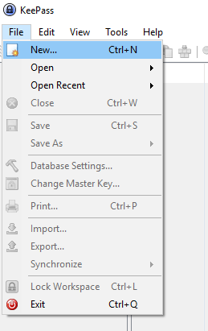
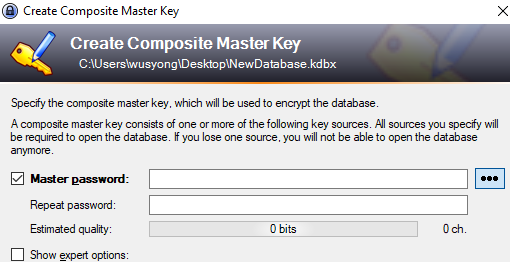
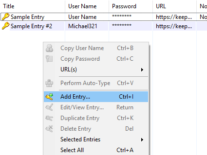
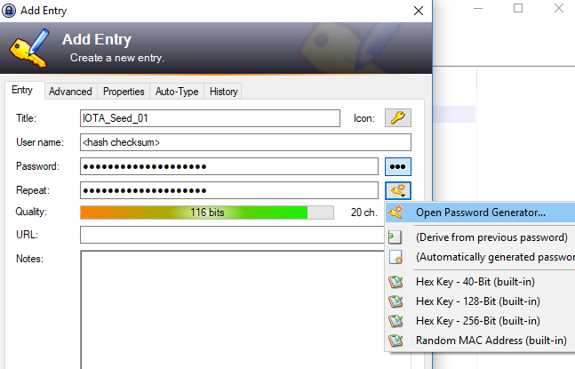
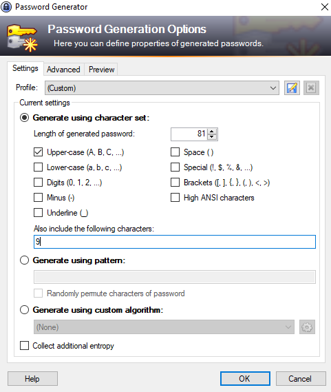
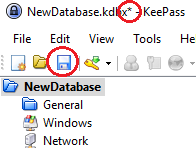

# 使用 KeePass 產生種子並安全保存的方法

產生種子的方式百百種，在 UNIX 系統上可以用 /dev/urandom 生成，最簡單的話甚至可以用骰子硬幹出種子出來。以下提供使用 KeePass 此程式來產生種子，而且之後還能夠安全地保存你的種子。更棒的是，要是你有在用其他貨幣的軟體錢包，此方式也能夠一並使用到。

1.下載 KeePass
---
https://keepass.info 此頁面就有提供各版本下載連結，撰寫本文章時最新的版本分別是 2.38 與 1.35，理論上以上兩種在操作上沒甚麼太大的差別，以下文章將使用 2.38 做為參考。下載完後你可以透過以下連結驗證完整性：https://keepass.info/integrity.html 。如果確定無誤的話就可以自行安裝 KeePass。

2.建立新的 Database
---
- 選擇「File」->「New...」，然後點選「OK」，接下來為你的 database 檔案命名。

- **建立 Master password**，此密碼非常重要，每次要查看 database 時都必須輸入此密碼。

- 接下來你能調整你的 database 設定，不過在此教學中我們不會多做說明，沒有甚麼需求的話就繼續按下「OK」即可。
- 最後你能列印你的 emergency sheet，一樣暫時不用的話可以選擇「Skip 」。

3.建立新的 Entry
---
- 在 Sample Entry 下方右鍵然後選取「Add Entry」

- Title：為你的種子命名，在此例我們用「IOTA_Seed_01」
- User Name：要是你已經有自己種子的話可以在錢包查詢你的 checksum 然後輸入在這裡，要是還沒有的話沒關係可以先空著，之後產生新種子再事後補充。

4.用密碼產生器生成自己的種子
---
- 按下鑰匙圖案然後點選「Open Password Generator」

- 按照以下給的規格來設定產生器：
  1. 密碼長度為 81 位元
  2. 字母全為大寫
  3. 其他選項記得都不要勾
  4. 加入數字「9」

- 你可以與下圖核對輸入的選項正不正確：

- 如果都確定無誤的話就按「OK」並一路把 Entry 建立完成
- Entry 新增完成後**別忘了按下儲存**，不然你的種子就會這樣蒸發了，往後要是有更改設定記得一定都要有儲存到。

這樣一來你的種子就產生出來而且同時也有安全的地點能夠保存了，事後就看你要怎麼備份了，要更安全的話可以選擇存在加密硬碟或是 NAS 之類的，或是將種子手寫下來做成紙錢包，不過最重要的還是要記好你的 Master password。另外手機上面也有 KeePass的相關 App，Android 可以考慮 Kepass2Android，而 iOS 可以考慮 MiniKeePass。
