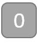
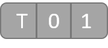

# 平衡三進位系統

## 三進位系統

* 三進位系統分為兩種：
  平衡三進位系統中使用 -1（T）、0、1 來表達一個 trit（或者用 -、0、+）
  非平衡三進位系統使用 0、1、2 來表達一個 trit
* 通常講三進位提到的會是非平衡三進位，不過以下將會專注在平衡三進位系統
* Trit 指的是 Trinary Digit，相較於二進位就是 bit
  其可以擁有的數值為 -1（T）、0、1



* Tryte 指的是 Trinary Byte, ，相較於二進位就是byte
  在 IOTA 中一個 tryte 包含 3 個 trits



* 1 byte = $$2^8$$ = 256 種組合
* 1 tryte = 3 trits = $$3^3$$ = 27 種組合
* 5 trits = $$3^5$$ = 27 種組合

## 平衡三進位系統

* 轉換 Tryte T10 成整數：  
  T x $$3^0$$ + 1 x $$3^1$$ + 0 x $$3^2$$  =   2

* 轉換 Tryte 1T1 成整數：  
  1 x $$3^0$$ + T x $$3^1$$ + 1 x $$3^2$$  = 7

* 2 trits   在平衡三進位中的組合如下：

11 = 1 x $$3^0$$ + 1 x $$3^1$$ = 4  
01 = 0 x $$3^0$$ + 1 x $$3^1$$ = 3  
T1 = T x $$3^0$$ + 1 x $$3^1$$ = 2  
10 = 1 x $$3^0$$ + 0 x $$3^1$$ = 1  
00 = 0 x $$3^0$$ + 0 x $$3^1$$ = 0  
T0 = T x $$3^0$$ + 0 x $$3^1$$ = -1  
1T = 1 x $$3^0$$ + T x $$3^1$$ = -2  
0T = 0 x $$3^0$$ + T x $$3^1$$ = -3  
TT = T x $$3^0$$ + T x $$3^1$$ = -4

最大值為 \($$3^2$$-1\)/2 = 4

* 一個 tryte 有 3 個 trits，所以最大值會是 \($$3^3$$ -1\) / 2 = 13 總共會有 $$3^3$$ = 27 種組合
* 一個 tryte 可以有以下數值：
  -13 ,-12 , …-2,-1 ,0 ,1 ,2 , …12,13
* 轉換以下 2 trytes T1TTT0 成整數：
  $$(T * 3^0 + 1 * 3^1 + T * 3^2)+(T * 3^3 + T * 3^4+ 0 * 3^5)=  -7 + -108 = -115$$

## 轉換十進制到平衡三進位

* 通常在做轉換時，我們會將左側是為最高有效位元，而右側為最低有效位元
* 欲轉換二進制到十進制：

  $$1010_{bin}$$ = 1 x $$2^3$$ + 0 x $$2^2$$ + 1 x $$2^1$$ + 0 x $$2^0$$ = $$10_{dec}$$
* 欲轉換三進制到十進制：  

  $$2012_{ternery}$$ = 2 x $$3^3$$ + 0 x $$3^2$$ + 1 x $$3^1$$ + 2 x $$3^0$$ = $$59_{dec}$$

* 欲轉換十進制到十進制：  
  $$5987_{ternery}$$ = 5 x $$10^3$$ + 9 x $$10^2$$ + 8 x $$10^1$$ + 7 x $$10^0$$ = $$5987_{dec}$$

* 欲轉換十進制到平衡三進制需要兩個步驟：  
  1.轉換十進位到三進位數值  
  2.轉換三進位到平衡三進位數值

### 轉換十進位到三進位

* 欲轉換十進位到三進位的方式和二進位一樣，透過除法依序取得餘數，以下將以 332 為例：

  332 = 110 x 3 + 2
  110 = 36 x 3 + 2
  36 = 12 x 3 + 0
  12 = 4 x 3 + 0
  4 = 1 x 3 + 1
  1 = 0 x 3 + 1
  
  所以 $$332_{dec}$$ 轉為三進制後就會是 $$110022_{ternery}$$

### 轉換三進位到平衡三進位數值

* 由於平衡三進位的最高與最低有效位元是相反的，所以必須先將數值顛倒過來：
  `110022 -> 220011`
* 因為平衡三進制中 2 是用 T1 表示，也就是說轉換時僅需在有 2 的位數加 1 再進位即可：

```
220011
11    +
-------
T01011
```

* 所以最終 332 的平衡三進位表示就是 T01011
* 至於負整數的轉換一樣，不過一開始先將負號移除做轉換，轉換完後再將所有位數的 1 或 T 互換即可，也就是說 -332 的平衡三進位表示會是 10T0TT

## IOTA Tryte 字母系統

* IOTA 使用平衡三進位系統
* 為了方便一般人閱讀， IOTA 開發團隊建立了 tryte 字母系統：9ABCDEFGHIJKLMNOPQRSTUVWXYZ
* Tryte 字母系統包含 26 個拉丁字母再加上數字 9，總共 27 個字母。
* 因為 1 tryte $3^3$ = 27 種組合，每個 tryte 都能夠代表一個字母。

| Tryte | 十進位 | 字母 | Tryte | 十進位 | 字母 |
| :---: | :---: | :---: | :---: | :---: | :---: |
|  |  |  | 000 | 0 | 9 |
| 100 | 1 | A | TTT | -13 | N |
| T10 | 2 | B | 0TT | -12 | O |
| 010 | 3 | C | 1TT | -11 | P |
| 110 | 4 | D | T0T | -10 | Q |
| TT1 | 5 | E | 00T | -9 | R |
| 0T1 | 6 | F | 10T | -8 | S |
| 1T1 | 7 | G | T1T | -7 | T |
| T01 | 8 | H | 01T | -6 | U |
| 001 | 9 | I | 11T | -5 | V |
| 101 | 10 | J | TT0 | -4 | W |
| T11 | 11 | K | 0T0 | -3 | X |
| 011 | 12 | L | 1T0 | -2 | Y |
| 111 | 13 | M | T00 | -1 | Z |

* IOTA 種子、地址、hashes 等等都是用 tryte 字母系統來顯示 tryte
* 舉例來說整數 -115 轉換成 tryte 就是 T1TTT0 再將 trytes 轉換成 tryte 字母：
  T1T = T
  TT0 = W
  所以整數 -115 轉換成 tryte 就會是 TW
* 「Zoo」此單字轉換成 trytes 就會像是：ICCDCD
  Z 在 ASCII 的數值為 90 然後轉換成 trytes： 001010 = IC
  o 在 ASCII 的數值為 111 然後轉換成 trytes： 010110 = CD

## IOTA 種子

* IOTA 種子包含 81 個字符等同於 81 trytes
* 舉例來說像是：C9RQFODNSAEOZVZKEYNVZDHYUJSA9QQRCUJVBJD9KHAKPTAKZSNNKLJHE FFVK9AWVDAUJRYYKHGWQIAWF
* 每個 tryte 有 27 種組合，也就是說 IOTA 種子有 $$27^{81}$$ = ~8.71 x $$10^{115}$$ 種組合
* 全宇宙原子總數約為 ~$$10^{80}$$
* 比特幣則為 $$2^{256}$$ = ~1.15 x $$10^{77}$$ 種組合
* 地球上沙粒的總數約為 ~$$10^{20}$$


