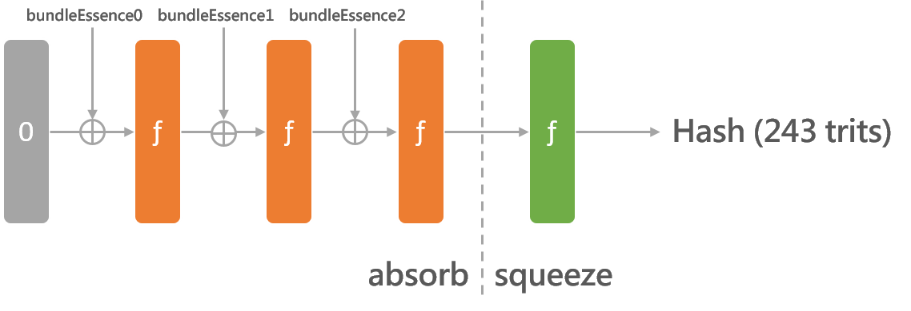
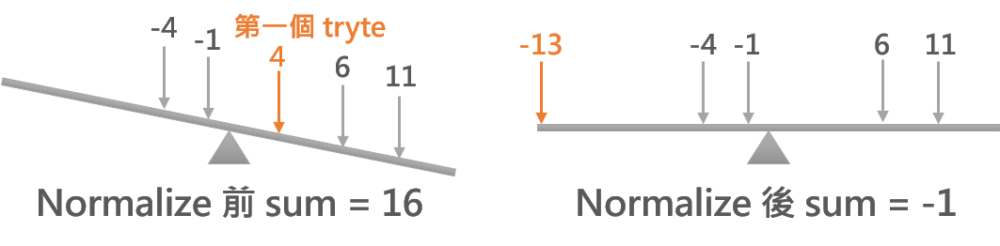

# Bundlehash

在產生交易時會用到 bundlehash 進行簽署，而 bundleHash 會從每筆交易的 bundle 來產生。以下將會用 [bundle.js](https://github.com/iotaledger/iota.lib.js/blob/v0.4.7/lib/crypto/bundle/bundle.js) 舉例說明如何產生 bundleHash，以及後續的處理步驟讓輸入的長度符合簽署資料的大小。

## 產生 bundleHash

在使用像 prepareTransfer 等 API 時，當 bundle 建立完成後，我們會用到 bundle 中每筆交易的 address, value, obsoleteTag, timestamp, currentIndex 和 lastIndex 來產生 bundlehash。其中 value、timestamp、currentIndex 和 lastIndex 會先轉換成 trits，之後再將所有參數都轉成 tryte 相加產生 bundleEssence，bundle 裡有多少交易數量就會有多少筆 bundleEssence：

```javascript
var bundleEssence = Converter.trits(this.bundle[i].address +
                                    Converter.trytes(valueTrits) +
                                    this.bundle[i].obsoleteTag +
                                    Converter.trytes(timestampTrits) +
                                    Converter.trytes(currentIndexTrits) +
                                    Converter.trytes(lastIndexTrits));
```

再來會用之前提過的海綿函數的架構，在這裡則是使用 Kerl 將每筆 bundleEssence 吸收，最後在擠出所需 hash，這串 243 trits 的 hash 轉換成 81 trytes 後就是所求的 bundleHash，bundle 中的每筆交易都會填入此數值。



## normalizedBundleHash

計算出 bundleHash 後我們會再拿來計算出 normalizedBundleHash，它不會填入交易資料中，但會拿來產生並驗證簽章。首先將 bundleHash 分成三的部分，每個部份的 tryte 按照 IOTA 字符系統轉換成十進位數值後，每個部份其中的數值再全部相加，如下所是總計會得到三個總和：

```
bundleHash = DAVB...CQFG | GKPA...LDBV | BQB9...QXLA
part0_sum = D+A+V+B+... = 4+1+(-5)+2+... = 41
part1_sum = G+K+P+A+... = 7+11+(-11)+1+... = -5
part2_sum = B+Q+B+9+... = 2+(-10)+2+0+... = 13
```

接下來每個部份的目標是重新分配權重，讓總和能夠維持平衡，如果總和大於等於零的話：

* 將第一個 tryte 的數值減一，再檢查總和是否小於零
* 如果不是的話就繼續減一直到總和小於零
* 如果已經減到 -13 (也就是 N) 且總和仍不小於零的話，就換下一個 tryte 繼續這樣的步驟
* 持續這樣的過程直到總和小於零

反之，如果總和小於零的話，一樣執行上面的動作，不過是讓 tryte 加一並且判斷總和是否大於等於零。當每個部份的總和都處理完後，將三個部分再組合回來就會產生出所要的 normalizedBundleHash。

這邊可以將 bundleHash 每個部份的總和視為天秤，如果為正的話會向右傾，為負責向左傾。normalizedBundleHash 的目標就是讓天秤可以維持在穩定的狀態。這樣能讓產生簽章時，私鑰的曝光率維持在 50% 左右。



在完成整個 bundleHash 前，最後會再檢驗 normalizedBundleHash 的 tryte 是否包含 M。如果有的話，將 bundle 中 tail transaction（index 0 的交易）的 obsoleteTag 轉換成 trits 後加一，然後重新再機算一次 bundleHash，直到 normalizedBundleHash 不包含 M 為止。會這樣做是因為 normalizedBundleHash 在產生簽章時，如果 tryte 為 M 的話是不會進行任何雜湊次數，這會讓私鑰其中一部份被暴露出來，詳細內容可以參考[簽章內容](../../wots.md)的說明。
